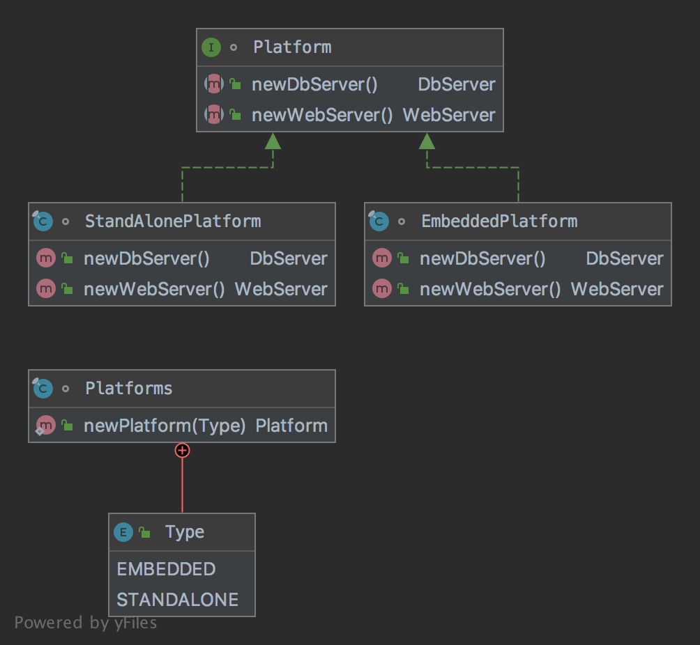

# The Abstract Factory Pattern

The pattern belongs to the creational category of the design patterns.

## Idea

Provide an interface for creating families of related or dependent objects without specifying their concrete classes.

## Explanation

Wikipedia says:

> The abstract factory pattern provides a way to encapsulate a group of individual factories that have a common theme 
without specifying their concrete classes.

In plain words:

> A factory of factories; a factory that groups the individual but related/dependent factories together without 
specifying their concrete classes.

## Class Diagram

The class diagram will be:



## Example

The task:

> Let's consider to create an embedded and standalone platforms with an appropriate web and database servers. 

Let's create an embedded platform:

```java
final class EmbeddedPlatform implements Platform {

    @Override
    public DbServer newDbServer() throws Exception {
        return DbServers.newH2dbServer();
    }

    @Override
    public WebServer newWebServer() throws Exception {
        return WebServers.newHttpServer();
    }
}
```

Let's create an standalone platform:

```java
final class StandAlonePlatform implements Platform {

    @Override
    public DbServer newDbServer() throws Exception {
        return DbServers.newH2dbServer();
    }

    @Override
    public WebServer newWebServer() throws Exception {
        return WebServers.newHttpServer();
    }
}
```

Let's create an interface and implementation of platforms:

```java
interface Platform {

    DbServer newDbServer() throws Exception;

    WebServer newWebServer() throws Exception;
}
```

```java
final class Platforms {

    public enum Type {
        EMBEDDED,
        STANDALONE
    }

    public static Platform newPlatform(final Type type) {
        switch (type) {
            case EMBEDDED:
                return new EmbeddedPlatform();
            case STANDALONE:
                return new StandAlonePlatform();
            default:
                throw new IllegalArgumentException(type.name() + " not supported.");
        }
    }
}
```

And then it can be used as:

```java
final var platform = Platforms.newPlatform(Platforms.Type.EMBEDDED);
assertNotNull(platform.newDbServer());
// Additional code
final var platform = Platforms.newPlatform(Platforms.Type.STANDALONE);
assertNotNull(platform.newDbServer());
```

## More Examples

* [javax.xml.parsers.DocumentBuilderFactory](https://docs.oracle.com/en/java/javase/11/docs/api/java.xml/javax/xml/parsers/DocumentBuilderFactory.html)
* [javax.xml.transform.TransformerFactory](https://docs.oracle.com/en/java/javase/11/docs/api/java.xml/javax/xml/transform/TransformerFactory.html)
* [javax.xml.xpath.XPathFactory](https://docs.oracle.com/en/java/javase/11/docs/api/java.xml/javax/xml/xpath/XPathFactory.html)

## Links

* [Abstract Factory Pattern](https://en.wikipedia.org/wiki/Abstract_factory_pattern)