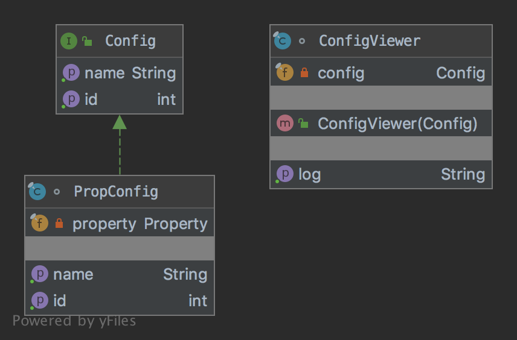

# The Adapter Pattern

The pattern belongs to the structural category of the design patterns.

## Idea 

Convert the interface of a class into another interface the clients expect. Adapter lets classes work together that 
couldn't otherwise because of incompatible interfaces.

## Explanation

Wikipedia says:

> In software engineering, the adapter pattern is a software design pattern that allows the interface of an existing 
class to be used as another interface. It is often used to make existing classes work with others without modifying 
their source code.

In plain words:

> Adapter pattern lets you wrap an otherwise incompatible object in an adapter to make it compatible with another class.

## Class Diagram

The class diagram will be:



## Example

The task:

> Let's consider that we should have a property object, but a config viewer accepts only instances of a config interface 
with related methods. 

Let's create a config interface:

```java
public interface Config {
    
    int getId();

    String getName();
}
```

And the the config viewer will be:

```java
final class ConfigViewer {
    private final Config config;

    public ConfigViewer(final Config config) {
        this.config = config;
    }

    public String getLog() {
        return config.getId() + "|" + config.getName();
    }
}
```

So the adapter will be:

```java
final class PropConfig implements Config {
    private final Property property = new Property.Builder("Property", 1).build();

    @Override
    public int getId() {
        return (int) property.asLong();
    }

    @Override
    public String getName() {
        final var name = property.getName();
        return property.getDescription().isPresent() ? name + "." + property.getDescription().get() : name;
    }
}
```

And finally it can be used as:

```java
final var propConfig = new PropConfig();
assertEquals(1, propConfig.getId());
assertEquals("Property", propConfig.getName());
// Additional code
assertEquals("1|Property", new ConfigViewer(new PropConfig()).getLog());
```

## More Examples

* [java.util.Arrays#asList()](https://docs.oracle.com/en/java/javase/11/docs/api/java.base/java/util/Arrays.html#asList(T...))
* [java.util.Collections#list()](https://docs.oracle.com/en/java/javase/11/docs/api/java.base/java/util/Collections.html#list(java.util.Enumeration))
* [java.util.Collections#enumeration()](https://docs.oracle.com/en/java/javase/11/docs/api/java.base/java/util/Collections.html#enumeration(java.util.Collection))

## Links

* [Adapter Pattern](https://en.wikipedia.org/wiki/Adapter_pattern)