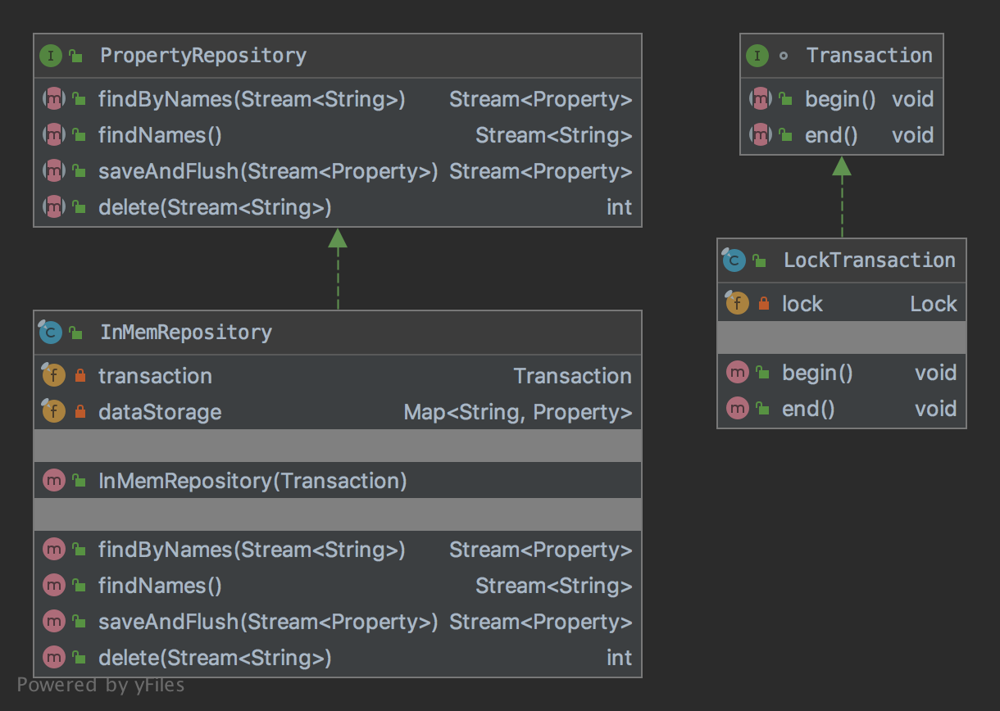

# The Bridge Pattern

The pattern belongs to the structural category of the design patterns.

## Idea 

Decouple an abstraction from its implementation so that the two can vary independently.

## Explanation

Wikipedia says:

> The bridge pattern is a design pattern used in software engineering that is meant to "decouple an abstraction from its 
implementation so that the two can vary independently"

In plain words:

> Bridge pattern is about preferring composition over inheritance. Implementation details are pushed from a hierarchy 
to another object with a separate hierarchy.

## Class Diagram

The class diagram will be:



## Example

The task:

> Let's consider we should have a property repository and a transaction where it can be changed independently.

Let's create a property repository interface:

```java
public interface PropertyRepository {

    Stream<Property> findByNames(final Stream<String> stream);

    Stream<String> findNames();

    Stream<Property> saveAndFlush(final Stream<Property> stream);

    int delete(final Stream<String> stream);
}
```

And then let's create a transaction interface:

```java
interface Transaction {

    void begin();

    void end();
}
```

So the in-memory repository will be:

```java
public final class InMemRepository implements PropertyRepository {
    private final Transaction transaction;
    private final Map<String, Property> dataStorage = new HashMap<>();

    public InMemRepository(final Transaction transaction) {
        this.transaction = transaction;
    }

    @Override
    public Stream<Property> findByNames(final Stream<String> stream) {
        transaction.begin();
        try {
            final Collection<Property> properties = new LinkedList<>();
            stream.forEach(name -> {
                final var property = dataStorage.get(name);
                if (property != null) {
                    properties.add(property);
                }
            });

            return properties.stream().sorted(Comparator.comparing(Property::getName));
        } finally {
            transaction.end();
        }
    }

    @Override
    public Stream<String> findNames() {
        transaction.begin();
        try {
            return dataStorage.keySet().stream().sorted();
        } finally {
            transaction.end();
        }
    }

    @Override
    public Stream<Property> saveAndFlush(final Stream<Property> stream) {
        transaction.begin();
        try {
            stream.forEach(property -> dataStorage.put(property.getName(), property));
            return dataStorage.values().stream();
        } finally {
            transaction.end();
        }
    }

    @Override
    public int delete(final Stream<String> stream) {
        transaction.begin();
        try {
            final var size = dataStorage.size();
            stream.forEach(dataStorage::remove);
            return size - dataStorage.size();
        } finally {
            transaction.end();
        }
    }
}
```

And the lock transaction will be:

```java
public final class LockTransaction implements Transaction {
    private final Lock lock = new ReentrantLock();

    @Override
    public void begin() {
        if (lock.tryLock()) {
            lock.lock();
        }
    }

    @Override
    public void end() {
        if (!lock.tryLock()) {
            lock.unlock();
        }
    }
}
```

And finally it can be used as:

```java
private final PropertyRepository repository = new InMemRepository(new LockTransaction());
// Additional code
final var property = new Property.Builder("Property", "Value").build();
final var stream = repository.saveAndFlush(Stream.of(property));
final var foundProperty = stream.findFirst();
// Check test results
assertTrue(foundProperty.isPresent());
assertEquals("Property", foundProperty.get().getName());
assertEquals("Value", foundProperty.get().getValue());
```

## Applicability

Use the bridge pattern when

* you want to avoid a permanent binding between an abstraction and its implementation. This might be the case, 
for example, when the implementation must be selected or switched at run-time.
* both the abstractions and their implementations should be extensible by subclassing. In this case, the Bridge pattern 
lets you combine the different abstractions and implementations and extend them independently
* changes in the implementation of an abstraction should have no impact on clients; that is, their code should not have 
to be recompiled.
* you have a proliferation of classes. Such a class hierarchy indicates the need for splitting an object into two parts. 
Rumbaugh uses the term "nested generalizations" to refer to such class hierarchies
* you want to share an implementation among multiple objects (perhaps using reference counting), and this fact should be 
hidden from the client. A simple example is Coplien's String class, in which multiple objects can share 
the same string representation.

## Links

* [Bridge Pattern](https://en.wikipedia.org/wiki/Bridge_pattern)