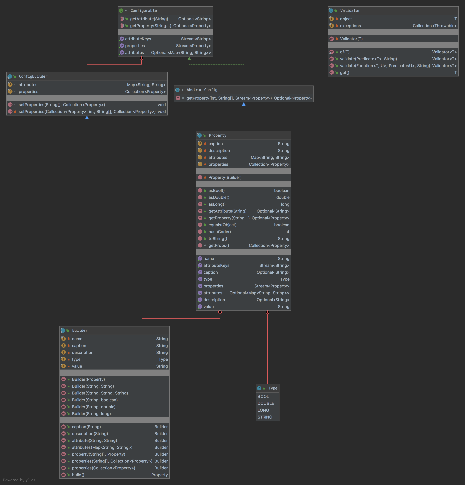

# The Builder Pattern

The pattern belongs to the creational category of the design patterns.

## Idea 

Separate the construction of a complex object from its representation so that the same construction process can create 
different representations.

## Explanation

Wikipedia says:

> The builder pattern is an object creation software design pattern with the intentions of finding a solution 
to the telescoping constructor anti-pattern.

In plain words:

> Allows you to create different flavors of an object while avoiding constructor pollution. Useful when there could be 
several flavors of an object. Or when there are a lot of steps involved in creation of an object.

## Class Diagram

The class diagram will be:



## Example

The task:

> Let's consider to create a property object that has many parameters with different types and we need to easily create 
various instances if the property. 

Let's create a property:

```java
public final class Property extends AbstractConfig {
    private final String name;
    private final String caption;
    private final String description;
    private final Type type;
    private final String value;
    private final Map<String, String> attributes;
    private final Collection<Property> properties;

    public enum Type {
        BOOL,
        DOUBLE,
        LONG,
        STRING
    }

    private Property(final Builder builder) {
        this.name = builder.name;
        this.caption = builder.caption;
        this.description = builder.description;
        this.type = builder.type;
        this.value = builder.value;
        this.attributes = builder.attributes;
        this.properties = builder.properties;
    }

    // Additional code
}
```

And the the builder will be:

```java
public final static class Builder extends ConfigBuilder {
    private final String name;
    private String caption;
    private String description;
    private final Type type;
    private final String value;

    public Builder(final Property property) {
        final var prototype = Validator.of(property).get();
        this.name = prototype.name;
        this.caption = prototype.caption;
        this.description = prototype.description;
        this.type = prototype.type;
        this.value = prototype.value;
        this.attributes.putAll(prototype.attributes);
        this.properties.addAll(prototype.properties);
    }

    public Builder(final String name, final String value) {
        this.name = Validator.of(name).get();
        this.type = Type.STRING;
        this.value = Validator.of(value).get();
    }

    public Builder(final String name, final String type, final String value) {
       this.name = Validator.of(name).get();
       this.type = Type.valueOf(Validator.of(type).get());
       this.value = Validator.of(value).get();
    }

    public Builder(final String name, final boolean value) {
       this.name = Validator.of(name).get();
       this.type = Type.BOOL;
       this.value = String.valueOf(value);
    }

    public Builder(final String name, final double value) {
       this.name = Validator.of(name).get();
       this.type = Type.DOUBLE;
       this.value = String.valueOf(value);
    }

    public Builder(final String name, final long value) {
       this.name = Validator.of(name).get();
       this.type = Type.LONG;
       this.value = String.valueOf(value);
    }

    public Builder caption(final String caption) {
       this.caption = caption;
       return this;
    }

    public Builder description(final String description) {
       this.description = description;
       return this;
    }

    public Builder attribute(final String key, final String value) {
       this.attributes.put(Validator.of(key).get(), Validator.of(value).get());
       return this;
    }

    public Builder attributes(final Map<String, String> attributes) {
       this.attributes.putAll(Validator.of(attributes).get());
       return this;
    }

    public Builder property(final String[] paths, final Property property) {
       return properties(paths, Collections.singletonList(Validator.of(property).get()));
    }

    public Builder properties(final String[] paths, final Collection<Property> properties) {
       setProperties(paths, properties);
       return this;
    }

    public Builder properties(final Collection<Property> properties) {
       this.properties.addAll(Validator.of(properties).get());
       return this;
    }

    public Property build() {
       return new Property(this);
    }
}
```

So it can be used as:

```java
final var firstSubProperty = new Property.Builder("Sub-Property-1", "Sub-Value-1").build();
final var secondSubProperty = new Property.Builder("Sub-Property-2", "Sub-Value-2").build();
final var thirdSubProperty = new Property.Builder("Sub-Property-3", "Sub-Value-3").build();
final var property = new Property.Builder("Property", "Value").
        caption("Caption").
        description("Description").
        attributes(Collections.singletonMap("key", "value")).
        property(new String[0], firstSubProperty).
        properties(new String[0], Collections.singletonList(secondSubProperty)).
        properties(Collections.singletonList(thirdSubProperty)).
        build();
// Check test results
assertEquals("Property", property.getName());
assertEquals(Property.Type.STRING, property.getType());
assertEquals("Value", property.getValue());
assertTrue(property.getCaption().isPresent());
assertEquals("Caption", property.getCaption().get());
assertTrue(property.getDescription().isPresent());
assertEquals("Description", property.getDescription().get());
assertTrue(property.getAttributes().isPresent());
assertEquals(1, property.getAttributes().get().size());
assertEquals(1, property.getAttributeKeys().count());
assertTrue(property.getAttribute("key").isPresent());
assertEquals(3, property.getProperties().count());
assertTrue(property.getProperty("Sub-Property-1").isPresent());
assertTrue(property.getProperty("Sub-Property-2").isPresent());
assertTrue(property.getProperty("Sub-Property-3").isPresent());
```

## More Examples

* [java.lang.StringBuilder](https://docs.oracle.com/en/java/javase/11/docs/api/java.base/java/lang/StringBuilder.html)
* [java.nio.ByteBuffer](https://docs.oracle.com/en/java/javase/11/docs/api/java.base/java/nio/ByteBuffer.html#put(byte%5B%5D)) as well as similar buffers such as FloatBuffer, IntBuffer and so on.
* [java.lang.StringBuffer](https://docs.oracle.com/en/java/javase/11/docs/api/java.base/java/lang/StringBuffer.html#append(boolean))
* All implementations of [java.lang.Appendable](https://docs.oracle.com/en/java/javase/11/docs/api/java.base/java/lang/Appendable.html)
* [Apache Commons Option.Builder](https://commons.apache.org/proper/commons-cli/apidocs/org/apache/commons/cli/Option.Builder.html)

## Links

* [Builder Pattern](https://en.wikipedia.org/wiki/Builder_pattern)