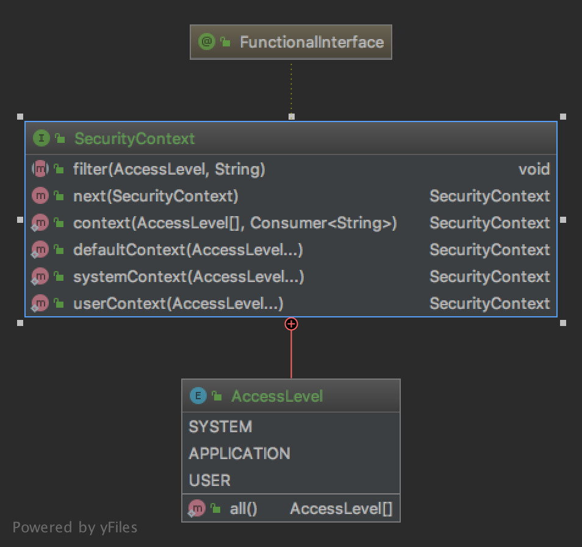

# The Chain Of Responsibility Pattern

The pattern belongs to the behavioral category of the design patterns.

## Idea 

Avoid coupling the sender of a request to its receiver by giving more than one object a chance to handle the request. 
Chain the receiving objects and pass the request along the chain until an object handles it.

## Explanation

Wikipedia says:

> In object-oriented design, the chain-of-responsibility pattern is a design pattern consisting of a source of 
command objects and a series of processing objects. Each processing object contains logic that defines the types of 
command objects that it can handle; the rest are passed to the next processing object in the chain.

In plain words:

> It helps building a chain of objects. Request enters from one end and keeps going from object to object till it 
finds the suitable handler.

## Class Diagram

The class diagram will be:



## Example

The task:

> Let's consider to create a security context with different access levels that should also treat a chain of 
security contexts.

Let's create a security context:

```java
@FunctionalInterface
interface SecurityContext {
    enum AccessLevel {
        SYSTEM, APPLICATION, USER;

        public static AccessLevel[] all() {
            return values();
        }
    }

    void filter(final AccessLevel level, final String request);

    default SecurityContext next(final SecurityContext securityContext) {
        return (level, request) -> {
            filter(level, request);
            next.filter(level, request);
        };
    }

    static SecurityContext context(final AccessLevel[] levels, final Consumer<String> requestHandler) {
        final EnumSet<AccessLevel> accessLevels = EnumSet.copyOf(Arrays.asList(levels));
        return (level, request) -> {
            if (accessLevels.contains(level)) {
                requestHandler.accept(request);
            }
        };
    }

    static SecurityContext defaultContext(final AccessLevel... levels) {
        return context(levels, request -> System.out.println("Default context: " + request));
    }

    static SecurityContext systemContext(final AccessLevel... levels) {
        return context(levels, request -> System.out.println("System context: " + request));
    }

    static SecurityContext userContext(final AccessLevel... levels) {
        return context(levels, request -> System.out.println("User context: " + request));
    }
}
```

So it can be used as:

```java
final var context = SecurityContext.defaultContext(SecurityContext.AccessLevel.all()).
        next(SecurityContext.userContext(SecurityContext.AccessLevel.USER)).
        next(SecurityContext.systemContext(SecurityContext.AccessLevel.SYSTEM, SecurityContext.AccessLevel.USER));

context.filter(SecurityContext.AccessLevel.SYSTEM, "First request.");
context.filter(SecurityContext.AccessLevel.APPLICATION, "Second request.");
context.filter(SecurityContext.AccessLevel.USER, "Third request.");
```

## More Examples

* [java.util.logging.Logger#log()](https://docs.oracle.com/en/java/javase/11/docs/api/java.logging/java/util/logging/Logger.html#log(java.util.logging.Level,java.lang.String))
* [com.sun.net.httpserver.Filter.Chain#doFilter​()](https://docs.oracle.com/en/java/javase/11/docs/api/jdk.httpserver/com/sun/net/httpserver/Filter.Chain.html#doFilter(com.sun.net.httpserver.HttpExchange))

## Links

* [Chain Of Responsibility Pattern](https://en.wikipedia.org/wiki/Chain-of-responsibility_pattern)