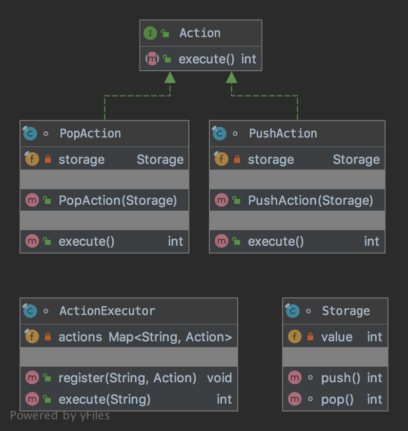

# The Command Pattern

The pattern belongs to the behavioral category of the design patterns.

## Idea 

Encapsulate a request as an object, thereby letting you parameterize clients with different requests, queue or 
log requests, and support undoable operations.

## Explanation

Wikipedia says:

> In object-oriented programming, the command pattern is a behavioral design pattern in which an object is used 
to encapsulate all information needed to perform an action or trigger an event at a later time. This information 
includes the method name, the object that owns the method and values for the method parameters.

In plain words:

> Using command objects makes it easier to construct general components that need to delegate, sequence or execute 
method calls at a time of their choosing without the need to know the class of the method or the method parameters.

## Class Diagram

The class diagram will be:



## Example

The task:

> Let's consider to create an action command that will encapsulate a storage and provide an action to perform.

Let's create a storage object:

```java
final class Storage {
    private int value = 0;

    int push() {
        value = 1000;
        return 1;
    }

    int pop() {
        return value;
    }
}
```

And then let's create a specification of an action:

```java
public interface Action {

    int execute();
}
```

We need an executor to register and perform actions:

```java
final class ActionExecutor {
    private final Map<String, Action> actions = new HashMap<>();

    public void register(final String actionName, final Action action) {
        actions.put(actionName, action);
    }

    public int execute(final String actionName) {
        final var action = actions.get(actionName);
        if (action == null) {
            throw new IllegalStateException("No action registered: " + actionName);
        }

        return action.execute();
    }
}
```

Implementations of actions will look like:

```java
final class PopAction implements Action {
    private final Storage storage;

    public PopAction(final Storage storage) {
        this.storage = storage;
    }

    @Override
    public int execute() {
        return storage.pop();
    }
}
```

And:

```java
final class PushAction implements Action {
    private final Storage storage;

    public PushAction(final Storage storage) {
        this.storage = storage;
    }

    @Override
    public int execute() {
        return storage.push();
    }
}
```

And then it can be used as:

```java
final var storage = new Storage();

final var executor = new ActionExecutor();
executor.register("push", storage::push);
executor.register("pop", storage::pop);

assertEquals(0, executor.execute("pop"));
assertEquals(1, executor.execute("push"));
assertEquals(1000, executor.execute("pop"));
```

## More Examples

* [java.lang.Runnable](https://docs.oracle.com/en/java/javase/11/docs/api/java.base/java/lang/Runnable.html)
* [Netflix Hystrix](https://github.com/Netflix/Hystrix/wiki)
* [javax.swing.Action](https://docs.oracle.com/en/java/javase/11/docs/api/java.desktop/javax/swing/Action.html)

## Links

* [Command Pattern](https://en.wikipedia.org/wiki/Command_pattern)