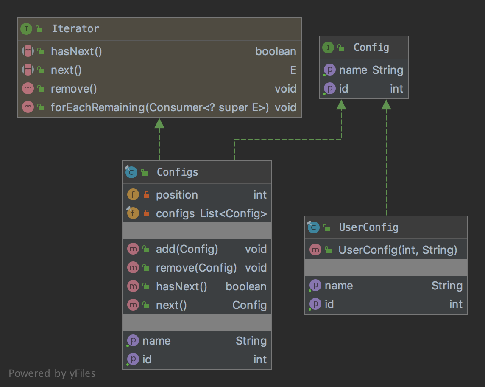

# The Composite Pattern

The pattern belongs to the structural category of the design patterns.

## Idea 

Compose objects into tree structures to represent part-whole hierarchies. Composite lets clients treat individual objects 
and compositions of objects uniformly.

## Explanation

Wikipedia says:

> In software engineering, the composite pattern is a partitioning design pattern. The composite pattern describes that 
a group of objects is to be treated in the same way as a single instance of an object. The intent of a composite is 
to "compose" objects into tree structures to represent part-whole hierarchies. Implementing the composite pattern lets 
clients treat individual objects and compositions uniformly.

In plain words:

> Composite pattern lets clients treat the individual objects in a uniform manner.

## Class Diagram

The class diagram will be:



## Example

The task:

> Let's consider we should have a general config object that contains user configs and they should have a uniform way of 
the processing.

Let's re-use the existed interface from the adapter chapter:

```java
public interface Config {

    int getId();

    String getName();
}
```

And the general config object will be:

```java
public final class Configs implements Config {
    private final List<Config> configs = new LinkedList<>();

    public void add(final Config config) {
        configs.add(config);
    }

    public void remove(final Config config) {
        configs.remove(config);
    }

    @Override
    public int getId() {
        var value = 0;
        for (final var config : configs) {
            value += config.getId();
        }

        return value;
    }

    @Override
    public String getName() {
        final var name = new StringBuilder();
        for (final var config : configs) {
            name.append(config.getName()).append(";");
        }

        name.deleteCharAt(name.indexOf(";"));
        return name.toString();
    }
}
```

The user config will be:

```java
public final class UserConfig implements Config {
    private final int id;
    private final String name;

    public UserConfig(final int id, final String name) {
        this.id = id;
        this.name = name;
    }

    @Override
    public int getId() {
        return id;
    }

    @Override
    public String getName() {
        return name;
    }
}
```

And finally it can be used as:

```java
final var configs = new Configs();
configs.add(new UserConfig(100, "Name"));
assertEquals(100, configs.getId());
// Additional code
final var configs = new Configs();
configs.add(new UserConfig(100, "Name"));
assertEquals("Name", configs.getName());
// Additional code
final var userConfig = new UserConfig(100, "Name");
assertEquals(100, userConfig.getId());
// Additional code
final var userConfig = new UserConfig(100, "Name");
assertEquals("Name", userConfig.getName());
```

## More Examples

* [java.awt.Container](https://docs.oracle.com/en/java/javase/11/docs/api/java.desktop/java/awt/Container.html)
* [java.awt.Component](https://docs.oracle.com/en/java/javase/11/docs/api/java.desktop/java/awt/Component.html)

## Links

* [Composite Pattern](https://en.wikipedia.org/wiki/Composite_pattern)