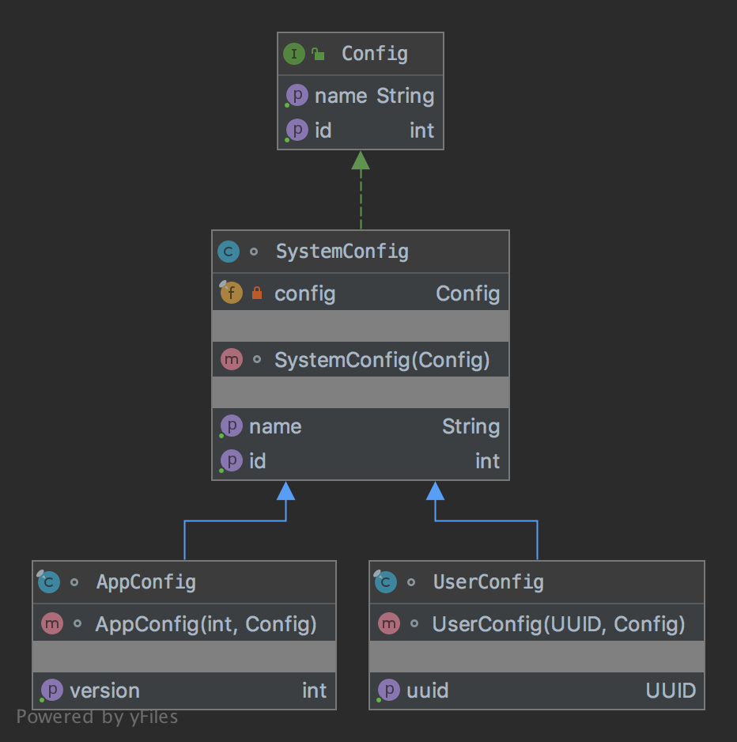

# The Decorator Pattern

The pattern belongs to the structural category of the design patterns.

## Idea 

Attach additional responsibilities to an object dynamically. Decorators provide a flexible alternative to subclassing 
for extending functionality.

## Explanation

Wikipedia says

> In object-oriented programming, the decorator pattern is a design pattern that allows behavior to be added to 
an individual object, either statically or dynamically, without affecting the behavior of other objects from 
the same class. The decorator pattern is often useful for adhering to the Single Responsibility Principle, as it allows 
functionality to be divided between classes with unique areas of concern.

In plain words

> Decorator pattern lets you dynamically change the behavior of an object at run time by wrapping them in an object of 
a decorator class.

## Class Diagram

The class diagram will be:



## Example

The task:

> Let's consider we should have various configs in an application. Each config adds its own information.

Let's re-use the existed interface from the adapter chapter:

```java
public interface Config {

    int getId();

    String getName();
}
```

And the system config that's the root will be:

```java
class SystemConfig implements Config {
    private final Config config;

    SystemConfig(final Config config) {
        this.config = config;
    }

    @Override
    public int getId() {
        return config.getId();
    }

    @Override
    public String getName() {
        return config.getName();
    }
}
```

The user config will be:

```java
final class UserConfig extends SystemConfig {
    private final UUID uuid;

    UserConfig(final UUID uuid, final Config config) {
        super(config);
        this.uuid = uuid;
    }

    public UUID getUuid() {
        return uuid;
    }
}
```

The application config will be:

```java
final class AppConfig extends SystemConfig {
    private final int version;

    AppConfig(final int version, final Config config) {
        super(config);
        this.version = version;
    }

    public int getVersion() {
        return version;
    }
}
```

And finally it can be used as:

```java
final var basedConfig = new Config() {
    @Override
    public int getId() {
        return 100;
    }

    @Override
    public String getName() {
        return "Name";
    }
};

final var appConfig = new AppConfig(1, new UserConfig(UUID.randomUUID(), new SystemConfig(basedConfig)));
assertEquals(100, appConfig.getId());
assertEquals(1, appConfig.getVersion());
assertEquals("Name", appConfig.getName());
```

## More Examples

* [java.io.InputStream](https://docs.oracle.com/en/java/javase/11/docs/api/java.base/java/io/InputStream.html), 
[java.io.OutputStream](https://docs.oracle.com/en/java/javase/11/docs/api/java.base/java/io/OutputStream.html),
 [java.io.Reader](https://docs.oracle.com/en/java/javase/11/docs/api/java.base/java/io/Reader.html) and 
 [java.io.Writer](https://docs.oracle.com/en/java/javase/11/docs/api/java.base/java/io/Writer.html)
* [java.util.Collections#synchronizedXXX()](https://docs.oracle.com/en/java/javase/11/docs/api/java.base/java/util/Collections.html#synchronizedCollection(java.util.Collection))
* [java.util.Collections#unmodifiableXXX()](https://docs.oracle.com/en/java/javase/11/docs/api/java.base/java/util/Collections.html#unmodifiableCollection(java.util.Collection))
* [java.util.Collections#checkedXXX()](https://docs.oracle.com/en/java/javase/11/docs/api/java.base/java/util/Collections.html#checkedCollection(java.util.Collection,java.lang.Class))
 
## Links

* [Decorator Pattern](https://en.wikipedia.org/wiki/Decorator_pattern)