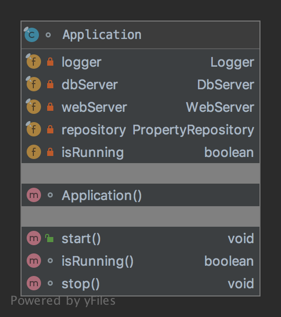

# The Facade Pattern

The pattern belongs to the structural category of the design patterns.

## Idea 

Provide a unified interface to a set of interfaces in a subsystem. Facade defines a higher-level interface that makes 
the subsystem easier to use.

## Explanation

Wikipedia says

> A facade is an object that provides a simplified interface to a larger body of code, such as a class library.

In plain words

> Facade pattern provides a simplified interface to a complex subsystem.

## Class Diagram

The class diagram will be:



## Example

The task:

> Let's consider we should have an application that has and runs the web and database server. 

Let's create an application:

```java
final class Application {
    private final Logger logger;
    private final DbServer dbServer;
    private final WebServer webServer;
    private final PropertyRepository repository;
    private boolean isRunning;

    Application() throws Exception {
        logger = Logger.INSTANCE;
        dbServer = DbServers.newH2dbServer();
        webServer = WebServers.newHttpServer();
        repository = new InMemRepository(new LockTransaction());
    }

    public void start() {
        try {
            dbServer.start();
        } catch (SQLException e) {
            throw new RuntimeException(e);
        }

        webServer.start();
        logger.setLevel(1);
        isRunning = true;
    }

    boolean isRunning() {
        return isRunning;
    }

    void stop() {
        logger.setLevel(0);
        webServer.stop();
        dbServer.stop();
        isRunning = false;
    }
}
```

And finally it can be used as:

```java
final var application = new Application();
application.start();
assertTrue(application.isRunning());
application.stop();
```

## Applicability

Use the Facade pattern when

* you want to provide a simple interface to a complex subsystem. Subsystems often get more complex  as they evolve. 
Most patterns, when applied, result in more and smaller classes. This makes the subsystem more reusable and easier 
to customize, but it also becomes harder to use for clients that don't need to customize it. A facade can provide 
a simple default view of the subsystem that is good enough for most clients. Only clients needing more customizability 
will need to look beyond the facade.
* there are many dependencies between clients and the implementation classes of an abstraction. Introduce a facade 
to decouple the subsystem from clients and other subsystems, thereby promoting subsystem independence and portability.
* you want to layer your subsystems. Use a facade to define an entry point to each subsystem level. If subsystems are 
dependent, then you can simplify the dependencies between them by making them communicate with each other solely 
through their facades.

## Links

* [Facade Pattern](https://en.wikipedia.org/wiki/Facade_pattern)