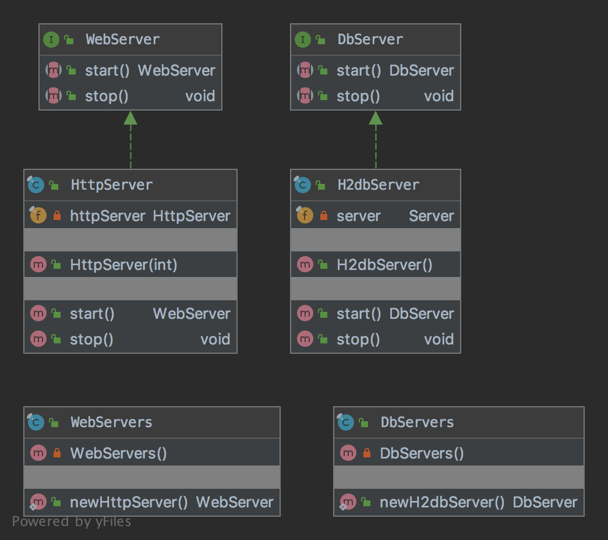

# The Factory Method Pattern

The pattern belongs to the creational category of the design patterns.

## Idea 

Define an interface for creating an object, but let subclasses decide which class to instantiate. 
Factory method lets a class defer instantiation to subclasses.

## Explanation

Wikipedia says:

> In class-based programming, the factory method pattern is a creational pattern that uses factory methods to deal with 
the problem of creating objects without having to specify the exact class of the object that will be created. 
This is done by creating objects by calling a factory method—either specified in an interface and implemented by 
child classes, or implemented in a base class and optionally overridden by derived classes—rather than by calling 
a constructor.

In plain words:

> It provides a way to delegate the instantiation logic to child classes.

## Class Diagram

The class diagram will be:



## Example

The task:

> Let's consider to create a db and web servers without showing the implementation and to delegate instantiation 
to child classes.

Let's create an interface and a database server:

```java
public interface DbServer {
    
    DbServer start() throws SQLException;

    void stop();
}
```

and the implementation will be:

```java
public final class H2dbServer implements DbServer {
    private final Server server;

    public H2dbServer() throws SQLException {
        this.server = Server.createTcpServer("-tcp", "-tcpPort", "8043", "-ifNotExists");
    }

    @Override
    public DbServer start() throws SQLException {
        if (!server.isRunning(true)) {
            server.start();
        }

        return this;
    }

    @Override
    public void stop() {
        if (server.isRunning(true)) {
            server.stop();
        }
    }
}
```

Let's create an interface and a web server:

```java
public interface WebServer {

    WebServer start();

    void stop();
}
```

and the implementation will be:

```java
public final class HttpServer implements WebServer {
    private final com.sun.net.httpserver.HttpServer httpServer;

    public HttpServer(final int port) throws Exception {
        final var payload = "pong";
        httpServer = com.sun.net.httpserver.HttpServer.create();
        httpServer.bind(new InetSocketAddress(port), 0);
        httpServer.createContext("/ping", exchange -> {
            exchange.sendResponseHeaders(200, payload.getBytes().length);

            final var output = exchange.getResponseBody();
            output.write(payload.getBytes());
            output.flush();

            exchange.close();

        });
        httpServer.setExecutor(null);
    }

    @Override
    public WebServer start() {
        httpServer.start();
        return this;
    }

    @Override
    public void stop() {
        httpServer.stop(0);
    }
}
```

And then they can be created as:

```java
public final class DbServers {

    private DbServers() {
        throw new AssertionError("Factory class can not be created.");
    }

    public static DbServer newH2dbServer() throws SQLException {
        return new H2dbServer();
    }
}
```

```java
public final class WebServers {

    private WebServers() {
        throw new AssertionError("Factory class can not be created.");
    }

    public static WebServer newHttpServer() throws Exception {
        return new HttpServer();
    }
}
```

And then it can be used as:

```java
final var server = DbServers.newH2dbServer().start();
assertGetSchema();
server.stop();
// Additional code
final var server = WebServers.newHttpServer().start();
final var client = HttpClient.newHttpClient();
final var request = HttpRequest.newBuilder()
        .uri(URI.create("http://localhost:8080/ping"))
        .GET()
        .build();
final var response = client.send(request, HttpResponse.BodyHandlers.ofString());
assertEquals(200, response.statusCode());
assertEquals("pong", response.body());
server.stop();
```

## More Examples

* [java.util.Calendar](https://docs.oracle.com/en/java/javase/11/docs/api/java.base/java/util/Calendar.html#getInstance())
* [java.util.ResourceBundle](https://docs.oracle.com/en/java/javase/11/docs/api/java.base/java/util/ResourceBundle.html#getBundle(java.lang.String))
* [java.text.NumberFormat](https://docs.oracle.com/en/java/javase/11/docs/api/java.base/java/text/NumberFormat.html#getInstance())
* [java.nio.charset.Charset](https://docs.oracle.com/en/java/javase/11/docs/api/java.base/java/nio/charset/Charset.html#forName(java.lang.String))
* [java.net.URLStreamHandlerFactory](https://docs.oracle.com/en/java/javase/11/docs/api/java.base/java/net/URLStreamHandlerFactory.html#createURLStreamHandler(java.lang.String))
* [java.util.EnumSet](https://docs.oracle.com/en/java/javase/11/docs/api/java.base/java/util/EnumSet.html#of(E))

## Links

* [Factory_Method Pattern](https://en.wikipedia.org/wiki/Factory_method_pattern)