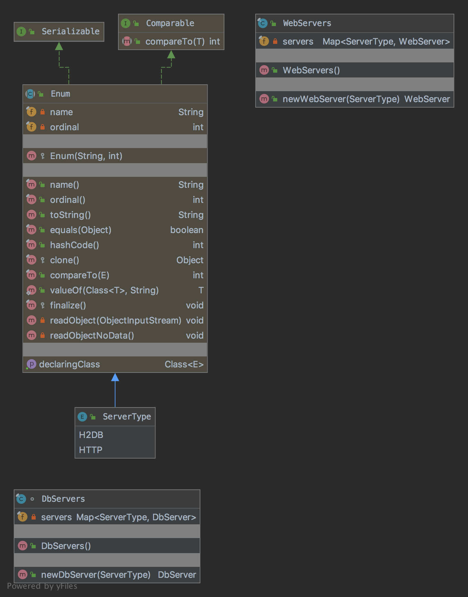

# The Flyweight Pattern

The pattern belongs to the structural category of the design patterns.

## Idea 

Use sharing to support large numbers of fine-grained objects efficiently.

## Explanation

Wikipedia says:

> In computer programming, flyweight is a software design pattern. A flyweight is an object that minimizes memory use 
by sharing as much data as possible with other similar objects; it is a way to use objects in large numbers when 
a simple repeated representation would use an unacceptable amount of memory.

In plain words:

> It is used to minimize memory usage or computational expenses by sharing as much as possible with similar objects.

## Class Diagram

The class diagram will be:



## Example

The task:

> Let's consider to create a db and web servers without showing the implementation and to delegate instantiation 
to child classes but in addition we need to cache created objects to simplify memory usage.

Let's create an enum of server types which we are going to support:

```java
public enum ServerType {
    H2DB, HTTP
}
```

implementation of servers are going to be taken from the factory method [chapter](../doc/factory-method.md).
Let's create implementation for the db and web servers:

```java
final class DbServers {
    private final Map<ServerType, DbServer> servers;

    public DbServers() {
        servers = new EnumMap<>(ServerType.class);
    }

    public DbServer newDbServer(final ServerType type) throws SQLException {
        var server = servers.get(type);
        if (server == null) {
            switch (type) {
                case H2DB:
                    server = new H2dbServer();
                    servers.put(type, server);
                    break;
                default:
                    break;
            }
        }

        return server;
    }
}
```

```java
final class WebServers {
    private final Map<ServerType, WebServer> servers;

    public WebServers() {
        this.servers = new EnumMap<>(ServerType.class);
    }

    public WebServer newWebServer(final ServerType type) throws Exception {
        var server = servers.get(type);
        if (server == null) {
            switch (type) {
                case HTTP:
                    server = new HttpServer(8081);
                    servers.put(type, server);
                    break;
                default:
                    break;
            }
        }

        return server;
    }
}
```

And then it can be used as:

```java
final var dbServers = new DbServers();
final var dbServer = dbServers.newDbServer(ServerType.H2DB);
assertNotNull(dbServer);
// Additional code
final var webServers = new WebServers();
final var webServer = webServers.newWebServer(ServerType.HTTP);
assertNotNull(webServer);
```

## More Examples

* [java.lang.Integer#valueOf(int)](https://docs.oracle.com/en/java/javase/11/docs/api/java.base/java/lang/Integer.html#valueOf(int)) 
and similarly for Byte, Character and other wrapped types.

## Links

* [Flyweight Pattern](https://en.wikipedia.org/wiki/Flyweight_pattern)