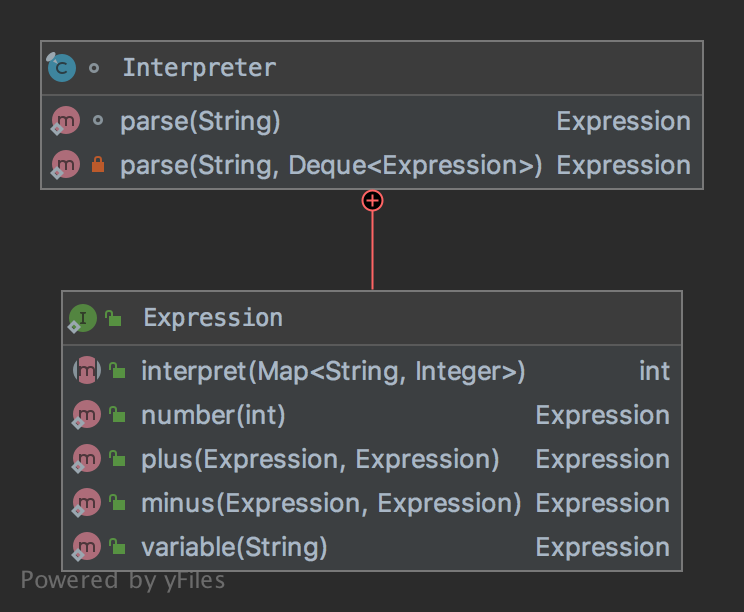

# The Interpreter Pattern

The pattern belongs to the behavioral category of the design patterns.

## Idea 

Given a language, define a representation for its grammar along with an interpreter that uses the representation 
to interpret sentences in the language.

## Explanation

Wikipedia says:

> In computer programming, the interpreter pattern is a design pattern that specifies how to evaluate sentences in a language. 

In plain words:

> The basic idea is to have a class for each symbol (terminal or nonterminal) in a specialized computer language.

## Class Diagram

The class diagram will be:



## Example

The task:

> Let's consider to create an interpreter for calculating basic arithmetic expressions.

Let's create an interpreter:

```java
final class Interpreter {

    @FunctionalInterface
    public interface Expression {
        
        int interpret(final Map<String, Integer> context);

        static Expression number(final int value) {
            return context -> value;
        }

        static Expression plus(final Expression left, final Expression right) {
            return context -> left.interpret(context) + right.interpret(context);
        }

        static Expression minus(final Expression left, final Expression right) {
            return context -> left.interpret(context) - right.interpret(context);
        }

        static Expression variable(final String value) {
            return context -> context.getOrDefault(value, 0);
        }
    }

    static Expression parse(final String expression) {
        final var expressions = new ArrayDeque<Expression>();
        for (final var token : expression.split(" ")) {
            expressions.push(parse(token, expressions));
        }

        return expressions.pop();
    }

    private static Expression parse(final String operator, final Deque<Expression> expressions) {
        Expression left, right;
        switch (operator) {
            case "+":
                // It's necessary to remove first the right operand from the stack
                right = expressions.pop();
                // ...and then the left one
                left = expressions.pop();
                return Expression.plus(left, right);
            case "-":
                right = expressions.pop();
                left = expressions.pop();
                return Expression.minus(left, right);
            default:
                return Expression.variable(operator);
        }
    }
}
```

And then it can be used as:

```java
final var expression = parse("w x z - +");
assertEquals(-27, expression.interpret(Map.of("w", 5, "x", 10, "z", 42)));
```

## More Examples

* [java.util.Pattern](https://docs.oracle.com/en/java/javase/11/docs/api/java.base/java/util/regex/Pattern.html)
* [java.text.Normalizer](https://docs.oracle.com/en/java/javase/11/docs/api/java.base/java/text/Normalizer.html)
* All subclasses of [java.text.Format](https://docs.oracle.com/en/java/javase/11/docs/api/java.base/java/text/Format.html)

## Links

* [Interpreter Pattern](https://en.wikipedia.org/wiki/Interpreter_pattern)