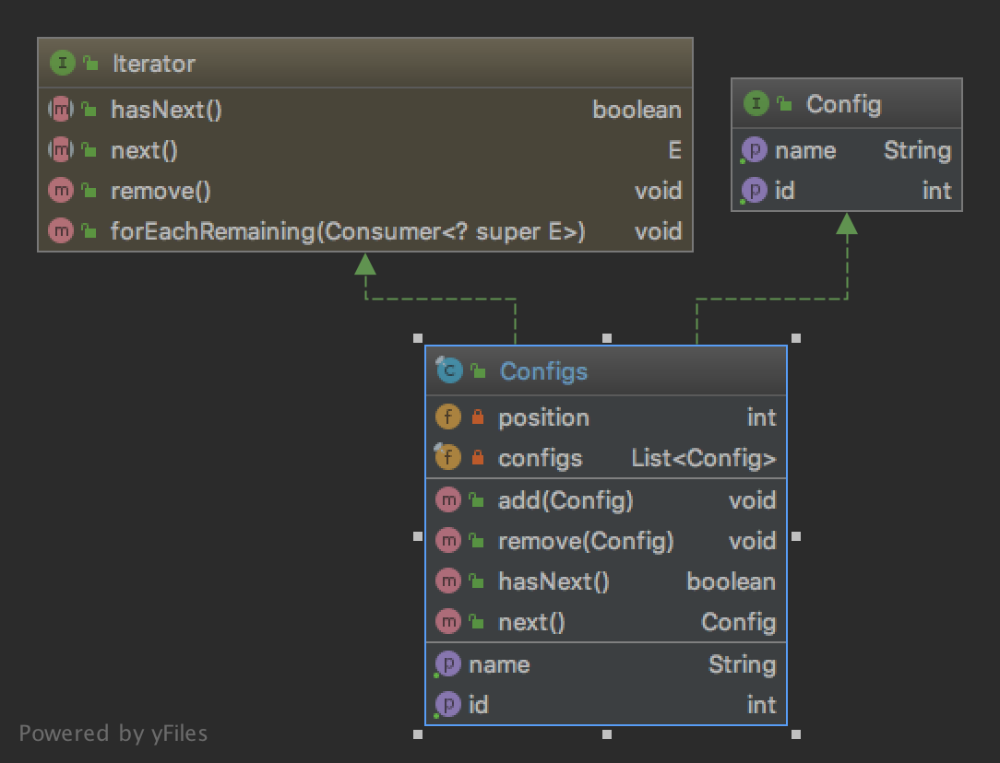

# The Iterator Pattern

The pattern belongs to the behavioral category of the design patterns.

## Idea 

Provide a way to access the elements of an aggregate object sequentially without exposing its underlying representation.

## Explanation

Wikipedia says:

> In object-oriented programming, the iterator pattern is a design pattern in which an iterator is used to traverse 
a container and access the container's elements. The iterator pattern decouples algorithms from containers; 
in some cases, algorithms are necessarily container-specific and thus cannot be decoupled. 

In plain words:

> Provide a way to access the elements of an aggregate object sequentially without exposing its underlying representation.

## Class Diagram

The class diagram will be:



## Example

The task:

> Let's extend configs class by adding implementation for the iteration logic.

Let's implement the iterator interface:

```java
public final class Configs implements Config, Iterator<Config> {
    private int position = 0;
    private final List<Config> configs = new LinkedList<>();

    public void add(final Config config) {
        configs.add(config);
    }

    public void remove(final Config config) {
        configs.remove(config);
    }

    @Override
    public int getId() {
        int value = 0;
        for (final var config : configs) {
            value += config.getId();
        }

        return value;
    }

    @Override
    public String getName() {
        final var name = new StringBuilder();
        for (final var config : configs) {
            name.append(config.getName()).append(";");
        }

        name.deleteCharAt(name.indexOf(";"));
        return name.toString();
    }

    @Override
    public boolean hasNext() {
        return position < configs.size() - 1;
    }

    @Override
    public Config next() {
        if (!hasNext()) {
            throw new NoSuchElementException();
        }

        return configs.get(position++);
    }
}
```

And then it can be used as:

```java
final var configs = new Configs();
configs.add(new UserConfig(1001, "Name 1"));
configs.add(new UserConfig(1002, "Name 2"));
configs.add(new UserConfig(1003, "Name 3"));

var position = 1;
while (configs.hasNext()) {
    final var config = configs.next();
    assertEquals(1000 + position, config.getId());
    assertEquals("Name " + position, config.getName());
    position++;
}
```

## More Examples

* [java.util.Iterator](https://docs.oracle.com/en/java/javase/11/docs/api/java.base/java/util/Iterator.html)
* [java.util.Enumeration](https://docs.oracle.com/en/java/javase/11/docs/api/java.base/java/util/Enumeration.html)

## Links

* [Iterator Pattern](https://en.wikipedia.org/wiki/Iterator_pattern)