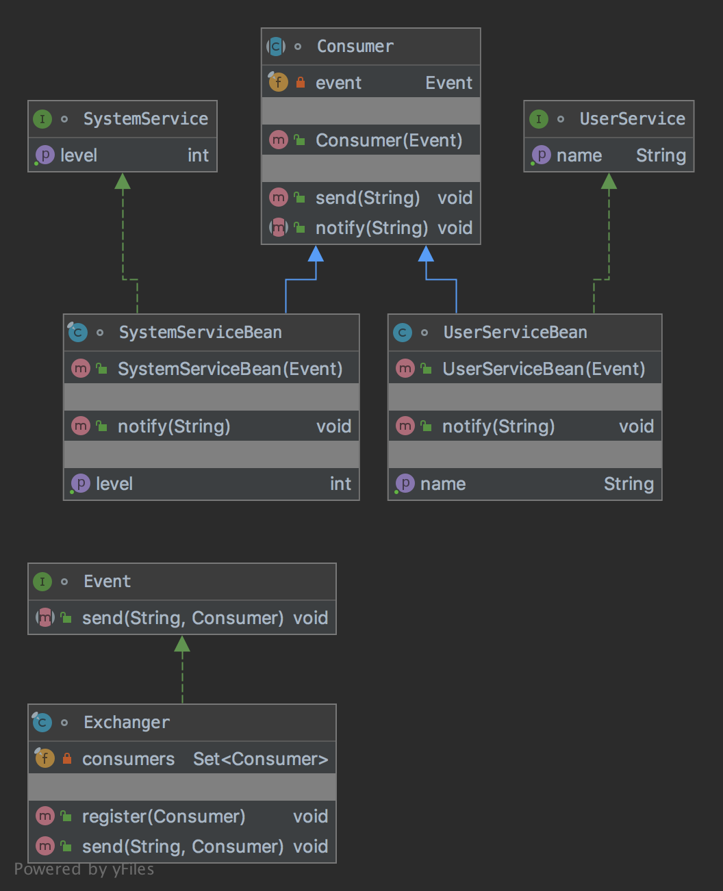

# The Mediator Pattern

The pattern belongs to the behavioral category of the design patterns.

## Idea 

Define an object that encapsulates how a set of objects interact. Mediator promotes loose coupling by keeping objects 
from referring to each other explicitly, and it lets you vary their interaction independently.

## Explanation

Wikipedia says:

> In software engineering, the mediator pattern defines an object that encapsulates how a set of objects interact. 
This pattern is considered to be a behavioral pattern due to the way it can alter the program's running behavior.

In plain words:

> With the mediator pattern, communication between objects is encapsulated within a mediator object.

## Class Diagram

The class diagram will be:



## Example

The task:

> Let's consider to create an event exchanger for application logic. System and user services will work independently.  

Let's implement the event interface:

```java
interface Event {
    
    void send(final String message, final Consumer consumer);
}
```

And the exchanger will be:

```java
final class Exchanger implements Event {
    private final Set<Consumer> consumers = new HashSet<>();

    public void register(final Consumer consumer) {
        consumers.add(consumer);
    }

    @Override
    public void send(final String message, final Consumer eventConsumer) {
        consumers.stream().
                filter(consumer -> consumer.equals(eventConsumer)).
                forEach(consumer -> consumer.notify(message));
    }
}
```

We need to create a base consumer now:

```java
abstract class Consumer {
    private final Event event;

    public Consumer(final Event event) {
        this.event = event;
    }

    public void send(final String message) {
        event.send(message, this);
    }

    public abstract void notify(final String message);
}
```

Let's define interfaces for the user and system services:

```java
interface SystemService {

    int getLevel();
}
```

```java
interface UserService {

    String getName();
}
```

And implementations are:

```java
final class SystemServiceBean extends Consumer implements SystemService {
    private int level;

    public SystemServiceBean(final Event event) {
        super(event);
    }

    @Override
    public void notify(final String message) {
        if ("setLevel".equals(message)) {
            level = 1000;
        }
    }

    @Override
    public int getLevel() {
        return level;
    }
}
```

```java
class UserServiceBean extends Consumer implements UserService {
    private String name;

    public UserServiceBean(final Event event) {
        super(event);
    }

    @Override
    public void notify(final String message) {
        if ("setName".equals(message)) {
            name = "My Name";
        }
    }

    @Override
    public String getName() {
        return name;
    }
}
```

And then it can be used as:

```java
final var exchanger = new Exchanger();
final var systemService = new SystemServiceBean(exchanger);
final var userService = new UserServiceBean(exchanger);

exchanger.register(systemService);
exchanger.register(userService);

systemService.send("setLevel");
userService.send("setName");

assertEquals(1000, systemService.getLevel());
assertEquals("My Name", userService.getName());
```

## More Examples

* All scheduleXXX() methods of [java.util.Timer](https://docs.oracle.com/en/java/javase/11/docs/api/java.base/java/util/Timer.html)
* [java.util.concurrent.Executor#execute()](https://docs.oracle.com/en/java/javase/11/docs/api/java.base/java/util/concurrent/Executor.html#)
* submit() and invokeXXX() methods of [java.util.concurrent.ExecutorService](https://docs.oracle.com/en/java/javase/11/docs/api/java.base/java/util/concurrent/ExecutorService.html#)
* scheduleXXX() methods of [java.util.concurrent.ScheduledExecutorService](https://docs.oracle.com/en/java/javase/11/docs/api/java.base/java/util/concurrent/ScheduledExecutorService.html#schedule(java.util.concurrent.Callable,long,java.util.concurrent.TimeUnit))
* [java.lang.reflect.Method#invoke()](https://docs.oracle.com/en/java/javase/11/docs/api/java.base/java/lang/reflect/Method.html#invoke(java.lang.Object,java.lang.Object...))

## Links

* [Mediator Pattern](https://en.wikipedia.org/wiki/Mediator_pattern)