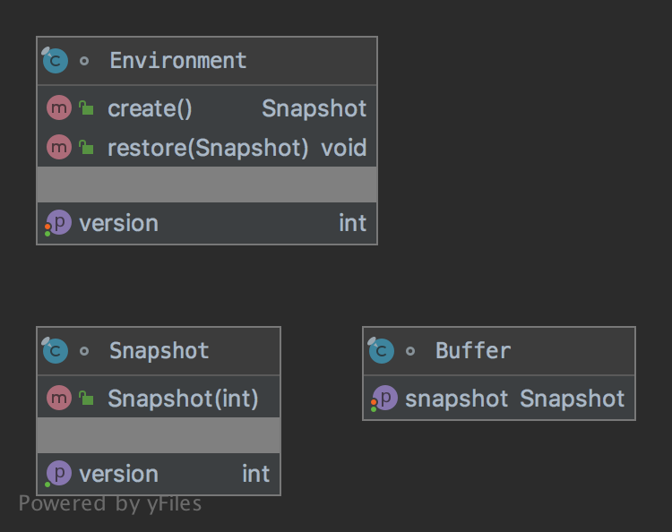

# The Memento Pattern

The pattern belongs to the behavioral category of the design patterns.

## Idea 

Without violating encapsulation, capture and externalize an object's internal state so that the object can be restored 
to this state later.

## Explanation

Wikipedia says:

> The memento pattern is a software design pattern that provides the ability to restore an object to its previous state 
(undo via rollback).

In plain words:

> With the memento pattern, it's possible to save and restore states.

## Class Diagram

The class diagram will be:



## Example

The task:

> Let's consider to create a snapshot with the current version and restore it later.  

Let's implement a snapshot class:

```java
final class Snapshot {
    private final int version;

    public Snapshot(final int version) {
        this.version = version;
    }

    public int getVersion() {
        return version;
    }
}
```

We need to create a buffer to keep a snapshot:

```java
final class Buffer {
    private Snapshot snapshot;

    public Snapshot getSnapshot() {
        return snapshot;
    }

    public void setSnapshot(final Snapshot snapshot) {
        this.snapshot = snapshot;
    }
}
```

Let's define an environment:

```java
final class Environment {
    private int version;

    public int getVersion() {
        return version;
    }

    public void setVersion(final int version) {
        this.version = version;
    }

    public Snapshot create() {
        return new Snapshot(version);
    }

    public void restore(final Snapshot snapshot) {
        this.version = snapshot.getVersion();
    }
}
```

And then it can be used as:

```java
final var environment = new Environment();
environment.setVersion(1000);
assertEquals(1000, environment.getVersion());

final var buffer = new Buffer();
buffer.setSnapshot(environment.create());
environment.setVersion(1001);
assertEquals(1001, environment.getVersion());

environment.restore(buffer.getSnapshot());
assertEquals(1000, environment.getVersion());
```

## More Examples

* [java.util.Date](https://docs.oracle.com/en/java/javase/11/docs/api/java.base/java/util/Date.html)

## Links

* [Memento Pattern](https://en.wikipedia.org/wiki/Memento_pattern)