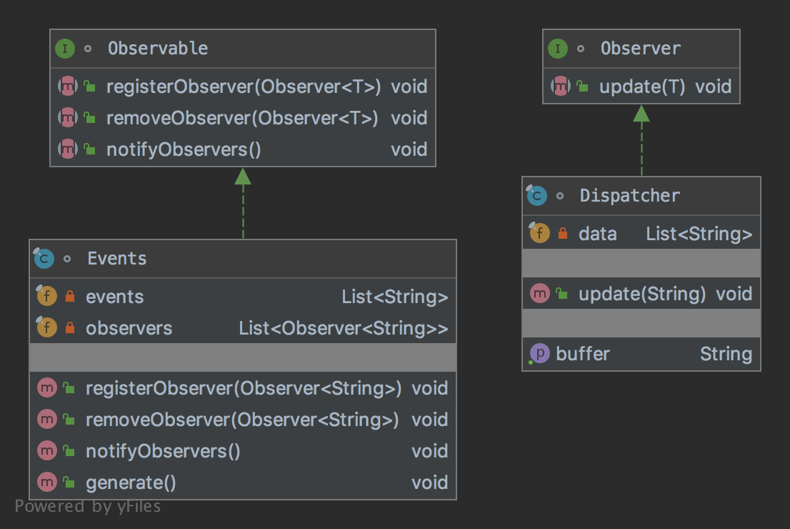

# The Observer Pattern

The pattern belongs to the behavioral category of the design patterns.

## Idea 

Define a one-to-many dependency between objects so that when one object changes state, all its dependents are notified 
and updated automatically.

## Explanation

Wikipedia says:

> The observer pattern is a software design pattern in which an object, called the subject, maintains a list of its 
dependents, called observers, and notifies them automatically of any state changes, usually by calling one of their methods.

In plain words:

> With the observer pattern, it's possible to provide communications between objects with event handling.

## Class Diagram

The class diagram will be:



## Example

The task:

> Let's consider to create a source that generates events and a dispatcher should buffer them. 

Let's define an observer:

```java
interface Observer<T> {

    void update(final T data);
}
```

We need to define an observable specification:

```java
interface Observable<T> {

    void registerObserver(final Observer<T> o);

    void removeObserver(final Observer<T> o);

    void notifyObservers();
}
```

Let's create an event source:

```java
final class Events implements Observable<String> {
    private final List<String> events = new LinkedList<>();
    private final List<Observer<String>> observers = new LinkedList<>();

    @Override
    public void registerObserver(final Observer<String> o) {
        observers.add(o);
    }

    @Override
    public void removeObserver(final Observer<String> o) {
        observers.remove(o);
    }

    @Override
    public void notifyObservers() {
        observers.forEach(observer -> {
            for (final var event : events) {
                observer.update(event);
            }
        });
    }

    public void generate() {
        IntStream.range(0, 5).forEach(value -> events.add("Event_" + value));
        notifyObservers();
    }
}
```

And a dispatcher will be:

```java
final class Dispatcher implements Observer<String> {
    private final List<String> data = new LinkedList<>();

    @Override
    public void update(final String data) {
        this.data.add(data);
    }

    public String getBuffer() {
        final var buffer = new StringBuilder();
        data.forEach(string -> buffer.append(string).append(":"));
        buffer.deleteCharAt(buffer.length() - 1);
        buffer.trimToSize();
        return buffer.toString();
    }
}
```

And then it can be used as:

```java
final var dispatcher = new Dispatcher();
final var events = new Events();
events.registerObserver(dispatcher);
events.generate();
events.removeObserver(dispatcher);

assertEquals("Event_0:Event_1:Event_2:Event_3:Event_4", dispatcher.getBuffer());
```

## More Examples

* [java.util.EventListener](https://docs.oracle.com/en/java/javase/11/docs/api/java.base/java/util/EventListener.html)
* [RxJava](https://github.com/ReactiveX/RxJava)

## Links

* [Observer Pattern](https://en.wikipedia.org/wiki/Observer_pattern)