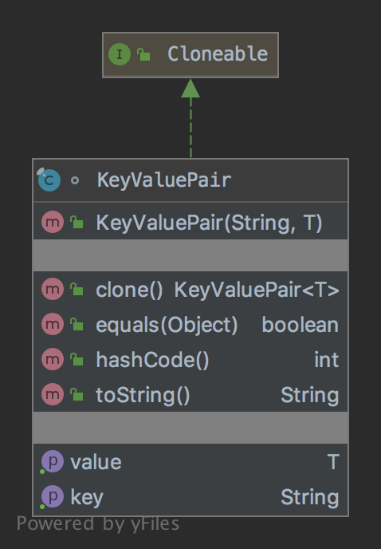

# The Prototype Pattern

The pattern belongs to the creational category of the design patterns.

## Idea

Specify the kinds of objects to create using a prototypical instance, and create new objects by copying this prototype.

## Explanation

Wikipedia says:

> The prototype pattern is a creational design pattern in software development. It is used when the type of objects 
to create is determined by a prototypical instance, which is cloned to produce new objects.

In plain words:

> Create object based on an existing object through cloning.

## Class Diagram

The class diagram will be:



## Example

The task:

> Let's consider to create a key-value object that can be used as a prototype for new objects.

Let's create a key-value object:

```java
final class KeyValuePair<T> implements Cloneable {
    private final String key;
    private final T value;

    public KeyValuePair(final String key, final T value) {
        this.key = Validator.of(key).get();
        this.value = Validator.of(value).get();
    }

    public String getKey() {
        return key;
    }
    
    public T getValue() {
        return value;
    }

    @Override
    public KeyValuePair<T> clone() {
        try {
            return (KeyValuePair<T>) super.clone();
        } catch (CloneNotSupportedException e) {
            throw new RuntimeException(e);
        }
    }

    // Additional code
}
```

And then it can be used as:

```java
final var pair = new KeyValuePair<>("key", "value");
// Check test results
assertEquals("key", pair.getKey());
assertEquals("value", pair.getValue());

final var clonedPair = pair.clone();
assertEquals("key", clonedPair.getKey());
assertEquals("value", clonedPair.getValue());
```

## More Examples

* [java.lang.Object#clone()](https://docs.oracle.com/en/java/javase/11/docs/api/java.base/java/lang/Object.html#clone())

## Links

* [Prototype Pattern](https://en.wikipedia.org/wiki/Prototype_pattern)