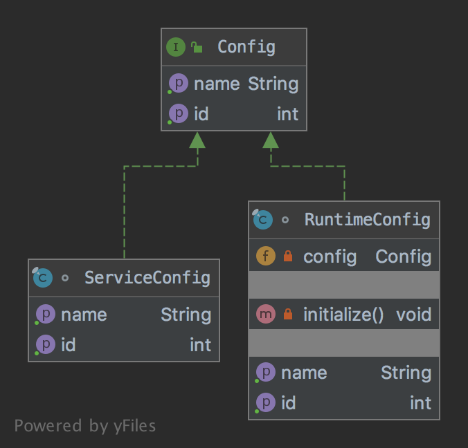

# The Proxy Pattern

The pattern belongs to the structural category of the design patterns.

## Idea 

Provide a surrogate or placeholder for another object to control access to it.

## Explanation

Wikipedia says

> A proxy, in its most general form, is a class functioning as an interface to something else. A proxy is a wrapper or 
agent object that is being called by the client to access the real serving object behind the scenes. Use of the proxy 
can simply be forwarding to the real object, or can provide additional logic. In the proxy extra functionality can be 
provided, for example caching when operations on the real object are resource intensive, or checking preconditions 
before operations on the real object are invoked.

In plain words

> Using the proxy pattern, a class represents the functionality of another class.

## Class Diagram

The class diagram will be:



## Example

The task:

> Let's consider to create a service configuration that's static and should be used during runtime.

Let's re-use the existed interface from the adapter chapter:

```java
public interface Config {

    int getId();

    String getName();
}
```

And the service config will be:

```java
final class ServiceConfig implements Config {

    @Override
    public int getId() {
        return 100;
    }


    @Override
    public String getName() {
        return "Service Name";
    }
}
```

The runtime config will be:

```java
final class RuntimeConfig implements Config {
    private Config config;

    @Override
    public int getId() {
        initialize();
        return 1000 + config.getId();
    }

    @Override
    public String getName() {
        initialize();
        return "Runtime: " + config.getName();
    }

    private void initialize() {
        if (config == null) {
            config = new ServiceConfig();
        }
    }
}
```

And finally it can be used as:

```java
final var runtimeConfig = new RuntimeConfig();
assertEquals(1100, runtimeConfig.getId());
// Additional code
final var runtimeConfig = new RuntimeConfig();
assertEquals("Runtime: Service Name", runtimeConfig.getName());
```

## More Examples

* [java.lang.reflect.Proxy](https://docs.oracle.com/en/java/javase/11/docs/api/java.base/java/lang/reflect/Proxy.html)
* [Apache Commons Proxy](https://commons.apache.org/proper/commons-proxy/)
* Mocking frameworks Mockito, Powermock, EasyMock

## Links

* [Proxy Pattern](https://en.wikipedia.org/wiki/Proxy_pattern)