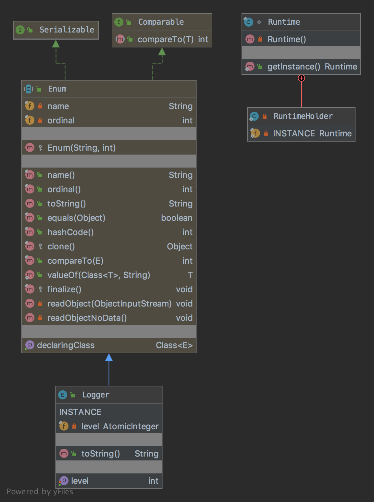

# The Singleton Pattern

The pattern belongs the creational category.

## Solution To The Problem

Ensure a class only has one instance, and provide a global point of access to it.

## Explanation

Real world example:

> Let's consider to have a logger and runtime objects which must be instantiated only once. 

In plain words:

> Ensures that only one object of a particular class is ever created.

Wikipedia says:

> In software engineering, the singleton pattern is a software design pattern that restricts the instantiation of a class to one object. This is useful when exactly one object is needed to coordinate actions across the system.

## Class Diagram

The class diagram will be:



## Coding Example

Let's create a logger:

```java
public enum Logger {
    INSTANCE;

    private final AtomicInteger level = new AtomicInteger(0);

    public int getLevel() {
        return level.get();
    }

    public void setLevel(int level) {
        this.level.set(level);
    }

    @Override
    public String toString() {
        return "Logger{" +
                "level=" + level +
                '}';
    }
}
```

And then it can be used as:

```java
final var logger = Logger.INSTANCE;
```
Let's create a Runtime:

```java
public final class Runtime {

    private Runtime() {
    }

    public static Runtime getInstance() {
        return RuntimeHolder.INSTANCE;
    }

    private static class RuntimeHolder {
        private static final Runtime INSTANCE = new Runtime();
    }
}
```

And then it can be used as:

```java
final var runtime = Runtime.getInstance();
```

## Real World Examples

* [java.lang.Runtime#getRuntime()](http://docs.oracle.com/javase/8/docs/api/java/lang/Runtime.html#getRuntime%28%29)
* [java.awt.Desktop#getDesktop()](http://docs.oracle.com/javase/8/docs/api/java/awt/Desktop.html#getDesktop--)
* [java.lang.System#getSecurityManager()](http://docs.oracle.com/javase/8/docs/api/java/lang/System.html#getSecurityManager--)

## Links

* [Singleton Pattern](https://en.wikipedia.org/wiki/Singleton_pattern)