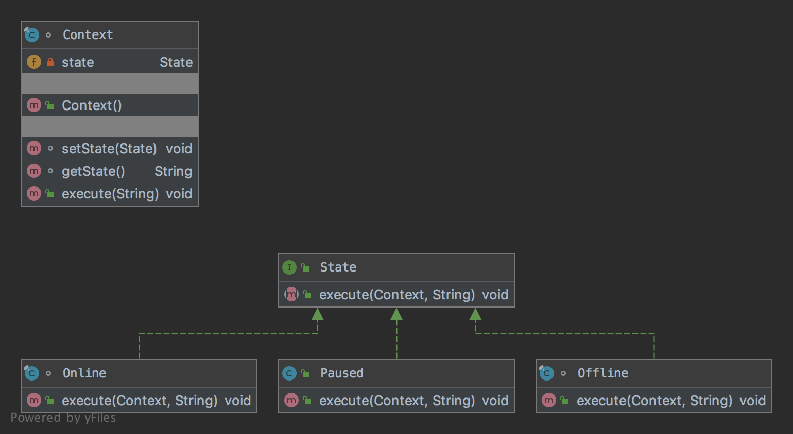

# The State Pattern

The pattern belongs to the behavioral category of the design patterns.

## Idea 

Allow an object to alter its behavior when its internal state changes. The object will appear to change its class.

## Explanation

Wikipedia says:

> The state pattern is a behavioral software design pattern that allows an object to alter its behavior when its 
internal state changes.

In plain words:

> With the state pattern, it's possible for an object to change its behavior at runtime without resorting 
to conditional statements and thus improve maintainability.

## Class Diagram

The class diagram will be:



## Example

The task:

> Let's consider to create a context that can change its states based on executed commands. 

Let's define a state specification:

```java
public interface State {

    void execute(final Context context, final String command);
}
```

We need to define a context:

```java
final class Context {
    private State state;

    public Context() {
        state = new Offline();
    }

    void setState(final State state) {
        this.state = state;
    }

    String getState() {
        return state.getClass().getSimpleName();
    }

    public void execute(final String command) {
        state.execute(this, command);
    }
}
```

Let's create different states (i.e. online, offline, Paused):

```java
final class Online implements State {

    @Override
    public void execute(final Context context, final String command) {
        if ("pause".equals(command)) {
            context.setState(new Paused());
        } else if ("stop".equals(command)) {
            context.setState(new Offline());
        }
    }
}
```

```java
final class Offline implements State {

    @Override
    public void execute(final Context context, final String command) {
        if ("start".equals(command)) {
            context.setState(new Online());
        }
    }
}
```

```java
public class Paused implements State {

    @Override
    public void execute(final Context context, final String command) {
        if ("start".equals(command)) {
            context.setState(new Online());
        } else if ("stop".equals(command)) {
            context.setState(new Offline());
        }
    }
}
```

And then it can be used as:

```java
final var context = new Context();
assertEquals("Offline", context.getState());
context.execute("start");
assertEquals("Online", context.getState());
context.execute("pause");
assertEquals("Paused", context.getState());
context.execute("stop");
assertEquals("Offline", context.getState());
```

## More Examples

* [JDiameter - Diameter State Machine](https://github.com/npathai/jdiameter/blob/master/core/jdiameter/api/src/main/java/org/jdiameter/api/app/State.java)

## Links

* [State Pattern](https://en.wikipedia.org/wiki/State_pattern)