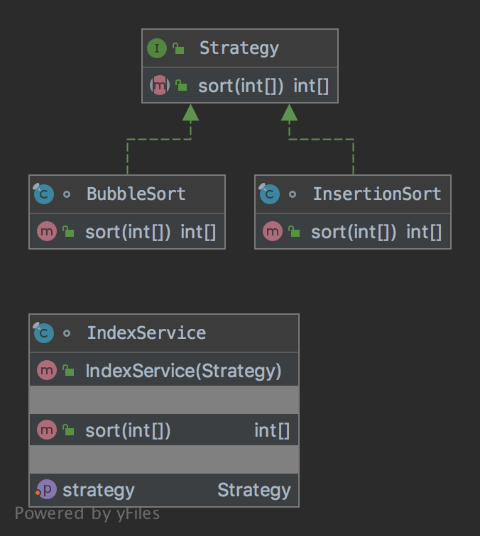

# The Strategy Pattern

The pattern belongs to the behavioral category of the design patterns.

## Idea 

Define a family of algorithms, encapsulate each one, and make them interchangeable. Strategy lets the algorithm vary 
independently from clients that use it.

## Explanation

Wikipedia says:

> In computer programming, the strategy pattern (also known as the policy pattern) is a behavioral software design 
pattern that enables selecting an algorithm at runtime.

In plain words:

> Using the strategy pattern, it lets the algorithm vary independently from clients that use it.

## Class Diagram

The class diagram will be:



## Example

The task:

> Let's consider to create an index service that should sort indices by a certain algorithm. 

Let's define a strategy specification:

```java
public interface Strategy {

    int[] sort(int[] indices);
}
```

We need to define an index service:

```java
final class IndexService {
    private Strategy strategy;

    public IndexService(final Strategy strategy) {
        this.strategy = strategy;
    }

    public void setStrategy(final Strategy strategy) {
        this.strategy = strategy;
    }

    public int[] sort(int[] indices) {
        return strategy.sort(indices);
    }
}
```

Let's create different strategies:

```java
final class BubbleSort implements Strategy {

    @Override
    public int[] sort(int[] indices) {
        int index;
        for (var i = 0; i < indices.length; i++) {
            for (var j = 0; j < indices.length - 1 - i; j++) {
                if (indices[j] > indices[j + 1]) {
                    index = indices[j];
                    indices[j] = indices[j + 1];
                    indices[j + 1] = index;
                }
            }
        }

        return indices;
    }
}
```

```java
final class InsertionSort implements Strategy {

    @Override
    public int[] sort(int[] indices) {
        int j, index;
        for (var i = 1; i < indices.length; i++) {
            index = indices[i];
            for (j = i; j > 0 && indices[j - 1] > index; j--) {
                indices[j] = indices[j - 1];
            }

            indices[j] = index;
        }

        return indices;
    }
}
```

And then it can be used as:

```java
var i = 0;
final var service = new IndexService(new BubbleSort());
for (final var index : service.sort(new int[]{10, 9, 8, 7, 6, 5, 4, 3, 2, 1})) {
    assertEquals(++i, index);
}
// Additional code
var i = 0;
final var service = new IndexService(new InsertionSort());
for (final var index : service.sort(new int[]{10, 9, 8, 7, 6, 5, 4, 3, 2, 1})) {
    assertEquals(++i, index);
}
```

## More Examples

* [java.util.Collections#sort()](https://docs.oracle.com/en/java/javase/11/docs/api/java.base/java/util/Collections.html#sort(java.util.List,java.util.Comparator))
* [java.util.Arrays#sort()](https://docs.oracle.com/en/java/javase/11/docs/api/java.base/java/util/Arrays.html#sort(T[],java.util.Comparator))

## Links

* [Strategy Pattern](https://en.wikipedia.org/wiki/Strategy_pattern)