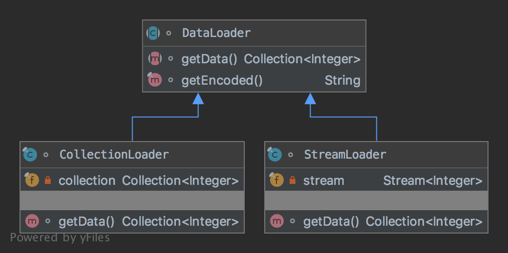

# The Template Method Pattern

The pattern belongs to the behavioral category of the design patterns.

## Idea 

Define the skeleton of an algorithm in an operation, deferring some steps to subclasses. Template method lets subclasses 
redefine certain steps of an algorithm without changing the algorithm's structure. To make sure that subclasses 
don’t override the template method, the template method should be declared final.

## Explanation

Wikipedia says:

> In object-oriented programming, the template method is one of the behavioral design patterns identified by 
Gamma et al. in the book Design Patterns. The template method is a method in a superclass, usually an abstract superclass, 
and defines the skeleton of an operation in terms of a number of high-level steps. 
These steps are themselves implemented by additional helper methods in the same class as the template method.

In plain words:

> Using the template method pattern, it's possible to define the overall structure of the operation, 
while allowing subclasses to refine, or redefine, certain steps.

## Class Diagram

The class diagram will be:



## Example

The task:

> Let's consider to create a data loader that encodes data from different sources i.e. from a collection and stream. 

Let's define a data loader:

```java
abstract class DataLoader {
    
    abstract Collection<Integer> getData();

    final String getEncoded() {
        final var encoded = new StringBuilder();
        getData().forEach(val -> encoded.append(":").append(val));
        return encoded.length() > 0 ? encoded.deleteCharAt(0).toString() : encoded.toString();
    }
}
```

We need to define a collection loader:

```java
final class CollectionLoader extends DataLoader {
    private final Collection<Integer> collection = List.of(1, 2, 3, 4, 5, 6, 7, 8, 9, 10);

    @Override
    Collection<Integer> getData() {
        return collection;
    }
}
```

We need to define a stream loader:

```java
final class StreamLoader extends DataLoader {
    private final Stream<Integer> stream = Stream.of(1, 2, 3, 4, 5, 6, 7, 8, 9, 10);

    @Override
    Collection<Integer> getData() {
        return stream.collect(Collectors.toList());
    }
}
```

And then it can be used as:

```java
final var dataLoader = new CollectionLoader();
assertEquals("1:2:3:4:5:6:7:8:9:10", dataLoader.getEncoded());
// Additional code
final var dataLoader = new StreamLoader();
assertEquals("1:2:3:4:5:6:7:8:9:10", dataLoader.getEncoded());
```

## More Examples

* [javax.servlet.GenericServlet.init](https://jakarta.ee/specifications/servlet/4.0/apidocs/javax/servlet/GenericServlet.html#init--): 
Method `GenericServlet.init(ServletConfig config)` calls the parameterless method `GenericServlet.init()` which is intended to be overridden in subclasses.
Method `GenericServlet.init(ServletConfig config)` is the template method in this example.

## Links

* [Template Method Pattern](https://en.wikipedia.org/wiki/Template_method_pattern)