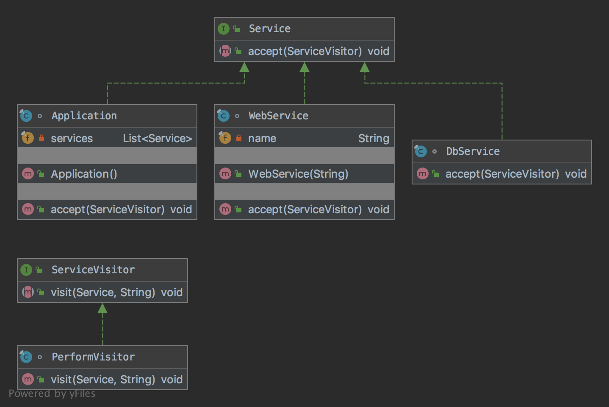

# The Visitor Pattern

The pattern belongs to the behavioral category of the design patterns.

## Idea 

Represent an operation to be performed on the elements of an object structure. Visitor lets you define a new operation 
without changing the classes of the elements on which it operates.

## Explanation

Wikipedia says:

> In object-oriented programming and software engineering, the visitor design pattern is a way of separating an algorithm 
from an object structure on which it operates. A practical result of this separation is the ability to add new operations 
to existing object structures without modifying the structures. It is one way to follow the open/closed principle.

In plain words:

> The visitor allows adding new virtual functions to a family of classes, without modifying the classes.

## Class Diagram

The class diagram will be:



## Example

The task:

> Let's consider to inspect a database, web service and an application with a visitor.

Let's define a service specification:

```java
public interface Service {

    void accept(final ServiceVisitor visitor);
}
```

We need to define a service visitor also:

```java
public interface ServiceVisitor {

    void visit(final Service service, final String name);
}
```

Let's create services:

```java
final class DbService implements Service {

    @Override
    public void accept(final ServiceVisitor visitor) {
        visitor.visit(this, "Database service");
    }
}
```

```java
final class WebService implements Service {
    private final String name;

    public WebService(final String name) {
        this.name = name;
    }

    @Override
    public void accept(final ServiceVisitor visitor) {
        visitor.visit(this, name);
    }
}
```

```java
final class Application implements Service {
    private final List<Service> services;

    public Application() {
        this.services = List.of(new DbService(), new WebService("Web service"));
    }

    @Override
    public void accept(final ServiceVisitor visitor) {
        for (final Service service : services) {
            service.accept(visitor);
        }

        visitor.visit(this, "Application");
    }
}
```

We need to implement a visitor:

```java
final class PerformVisitor implements ServiceVisitor {

    @Override
    public void visit(final Service service, final String name) {
        System.out.println("Visited: " + name);
    }
}
```

And then it can be used as:

```java
final var app = new Application();
app.accept(new PerformVisitor());
app.accept((service, name) -> System.out.println("Test visited: " + name));
```

## More Examples

* [Apache Wicket](https://github.com/apache/wicket) component tree, see [MarkupContainer](https://github.com/apache/wicket/blob/b60ec64d0b50a611a9549809c9ab216f0ffa3ae3/wicket-core/src/main/java/org/apache/wicket/MarkupContainer.java)
* [javax.lang.model.element.AnnotationValue](https://docs.oracle.com/en/java/javase/11/docs/api/java.compiler/javax/lang/model/element/AnnotationValue.html) and [AnnotationValueVisitor](https://docs.oracle.com/en/java/javase/11/docs/api/java.compiler/javax/lang/model/element/AnnotationValueVisitor.html)
* [javax.lang.model.element.Element](https://docs.oracle.com/en/java/javase/11/docs/api/java.compiler/javax/lang/model/element/Element.html) and [Element Visitor](https://docs.oracle.com/en/java/javase/11/docs/api/java.compiler/javax/lang/model/element/ElementVisitor.html)
* [java.nio.file.FileVisitor](https://docs.oracle.com/en/java/javase/11/docs/api/java.base/java/nio/file/FileVisitor.html)

## Links

* [Visitor Pattern](https://en.wikipedia.org/wiki/Visitor_pattern)